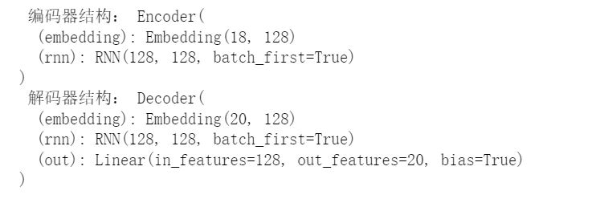
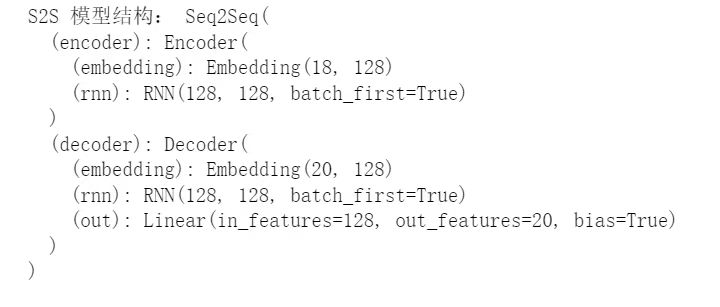

# 勘误表

## 一刷
### P6

LSTM 通过引入门控机制解决了 RNN 中的梯度消 失和梯度爆炸问题，

解决改为缓解。

### P51

输出改为

 词汇表： ['Kage', 'Niuzong', 'Xiaoxue', 'Mazong', 'Xiaobing', 'Teacher', 'is', 'Boss', 'Student']
 词汇到索引的字典： {'Kage': 0, 'Niuzong': 1, 'Xiaoxue': 2, 'Mazong': 3, 'Xiaobing': 4, 'Teacher': 5, 'is': 6, 'Boss': 7, 'Student': 8}
 索引到词汇的字典： {0: 'Kage', 1: 'Niuzong', 2: 'Xiaoxue', 3: 'Mazong', 4: 'Xiaobing', 5: 'Teacher', 6: 'is', 7: 'Boss', 8: 'Student'}
 词汇表大小： 9

### P53
print("Skip-Gram 数据样例（已编码）：", [(one_hot_encoding(context, word_to_idx),            word_to_idx[target]) for context, target in skipgram_data[:3]])

改为

print("Skip-Gram数据样例（已编码）：", [(one_hot_encoding(target, word_to_idx), word_to_idx[context]) for context, target in skipgram_data[:3]])

### P53

输出改为

One-Hot 编码前的单词： Teacher
One-Hot 编码后的向量： tensor([0., 0., 0., 0., 0., 1., 0., 0., 0.])
Skip-Gram数据样例（已编码）： [(tensor([1., 0., 0., 0., 0., 0., 0., 0., 0.]), 6), (tensor([1., 0., 0., 0., 0., 0., 0., 0., 0.]), 5), (tensor([0., 0., 0., 0., 0., 0., 1., 0., 0.]), 0)]

这是因为前后编码要对齐 （P51和P53）

### P73

输出改为

 词汇表： {'爸爸': 0, '我': 1, '玩具': 2, '爱': 3, '挨打': 4, '喜欢': 5, '讨厌': 6}
 词汇表大小： 7

### P74

输出改为

 输入批处理数据： tensor([[1, 5], [1, 3]])
 输入批处理数据对应的原始词： [['我', '喜欢'], ['我', '爱']]
 目标批处理数据： tensor([2, 0])
 目标批处理数据对应的原始词： ['玩具', '爸爸']

这是因为前后编码要对齐 （P73和P74）

## 二刷

###P60

原文：
我们使用 PyTorch 实现了一个简单的 Word2Vec（这里是 Skip Gram）模型。模型包括输入层、隐藏层和输出层。输入层接收周围词（以 One-Hot 编码后的向量形式表示）。接下来，输入层到隐藏层的权重矩阵（记为 input_to_hidden）将这个向量转换为词嵌入，该词嵌入直接作为隐藏层的输出。隐藏层到输出层的权重矩阵（记为 hidden_to_output）将隐藏层的输出转换为一个概率分布，用于预测与周围词相关的中心词（以索引形式表示）。通过最小化预测词和实际目标词之间的分类交叉熵损失，可以学习词嵌入向量。下图展示了这个流程。

改为：
我们使用 PyTorch 实现了一个简单的 Word2Vec（这里是 Skip Gram）模型。模型包括输入层、隐藏层和输出层。输入层接收中心词（以 One-Hot 编码后的向量形式表示）。接下来，输入层到隐藏层的权重矩阵（记为 input_to_hidden）将这个向量转换为词嵌入，该词嵌入直接作为隐藏层的输出。隐藏层到输出层的权重矩阵（记为 hidden_to_output）将隐藏层的输出转换为一个概率分布，用于预测与中心词相关的周围词（以索引形式表示）。通过最小化预测词和实际目标词之间的分类交叉熵损失，可以学习词嵌入向量。下图展示了这个流程。

图中“前缀”改为“前后缀”

### P93 / P96 / P98
数据集的维度和网络结构前后不一致，以Notebook为准

###P115

attn_weights  =  F.softmax(raw_weights, dim=2) #  形 状 (batch_size,  seq_len1,  seq_len2)
改为
attn_weights  =  F.softmax(scaled_weights, dim=2) #  形 状 (batch_size,  seq_len1,  seq_len2)